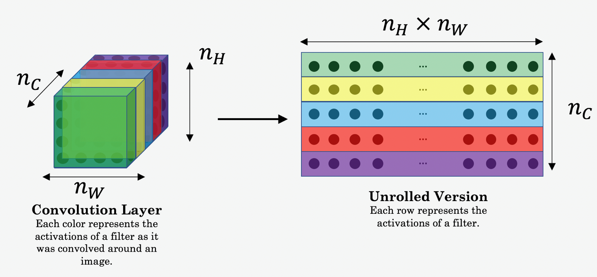
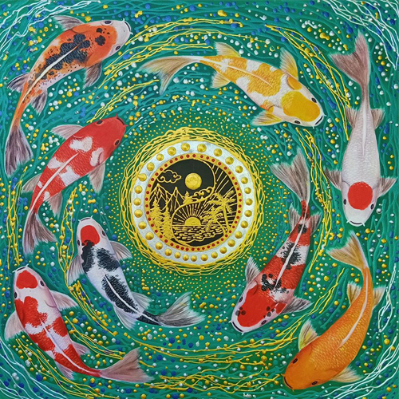

# Art-Generation
This project was built to generate 1 single piece of art(picture) by merging components from 2 input images.
It makes use of Neural Style Transfer.

Neural Style Transfer (NST) uses a previously trained convolutional network, and builds on top of that. The idea of using a network trained on a different task and applying it to a new task is called transfer learning.

NST uses a previously trained convolutional network, and builds on top of that.
Transfer learning is an idea, in which we use a network trained on a different task and apply it to a new task.

#### Computing the Cost function for content image **Jcontent(C,G)**

**Gram Matrix: Also called the 'style matrix'. It compares how similar two vectors are, using np.dot()**

**Content Image Used by me:**

